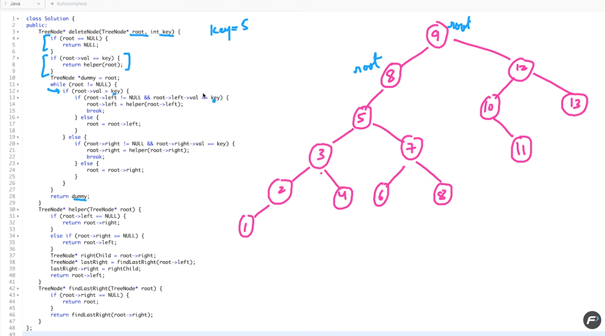

## 5.10.2026

## Search in BST

```cpp
// go left if need smaller else go right like in BS
class Solution {
public:
    TreeNode* searchBST(TreeNode* root, int val) {
        if(!root) return nullptr;
        if(root -> val == val) return root;
        if(val > root -> val) return searchBST(root -> right, val);
        return searchBST(root -> left, val);
    }
};
```

## Ceil in BST

```cpp
class Solution {
    void solve(Node* root, int x, int& res) {
        if(!root) return;
        // save if found better root->data
        if(root -> data >= x) {
            res = root -> data; //when you go left you'll automatically find a lesser value greater than equal to x, like in BS
            solve(root -> left, x, res);
            return;
        }
        // go right for finding a greater value
        solve(root -> right, x, res);
        return;
    }
  public:
    int findCeil(Node* root, int x) {
        // code here
        int res = INT_MAX;
        solve(root, x, res);
        if (res == INT_MAX) return -1;
        return res;
    }
};
```

## Min and Max in a BST

- left most is min
- right most is max

```cpp
class Solution {
  public:
    int minValue(Node* root) {
        // code here
        while(root -> left) {
            root = root -> left;
        }

        return root -> data;
    }
};
```

## Insert in a BST

```python
# Definition for a binary tree node.
# class TreeNode:
#     def __init__(self, val=0, left=None, right=None):
#         self.val = val
#         self.left = left
#         self.right = right
class Solution:

    def insertIntoBST(self, root: TreeNode | None, val: int) -> TreeNode | None:
        if not root:
            root = TreeNode(val=val)
            return root

        if root.val > val:
            root.left = self.insertIntoBST(root.left, val)
            return root

        if root.val < val:
            root.right = self.insertIntoBST(root.right, val)
            return root

        return root

```

## Delete node in a BST



## Valid BST

```cpp
class Solution {
    bool solve(TreeNode* root, long long mini, long long maxi) {
        if(!root) return true;
        if(root -> val <= mini || root -> val >= maxi) return false;
        return solve(root -> left, mini, root -> val) && solve(root -> right, root -> val, maxi);
    }
public:
    bool isValidBST(TreeNode* root) {
        return solve(root, LONG_LONG_MIN, LONG_LONG_MAX);
    }
};
```

## 26th July26

## Kth smallest node in BST

- BF: traverse -> sort -> find kth smallest or largest
- Optimise: inorder -> kth smallest
- Most optimal: use this snippet below in any order traversal / morris traversal (when you traverse the node after or before left / right traversals)

```cpp
 cnt++;
if(cnt == k) {
    res = root -> val;
    return;
}
```

- Solution: https://leetcode.com/submissions/detail/2082275485/
- for kth largest, use n - kth smallest :D

```python
class Solution:
    def solve(self, root, k):
        if not root:
            return None

        # Left
        ans = self.solve(root.left, k)
        if ans is not None:
            return ans

        # Current node, mimics pass by reference in c++
        self.cnt += 1

        if self.cnt == k:
            return root.val

        # Right
        return self.solve(root.right, k)

    def kthSmallest(self, root: TreeNode | None, k: int) -> int:
        self.cnt = 0
        return self.solve(root, k)
```
